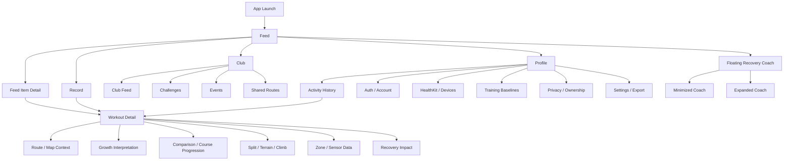

# SOOM IA Blueprint v1

## Purpose

SOOM IA Blueprint v1 reframes the app from a feature-first structure into a behavior-first product. The current app has strong modules for Recovery, Analysis, Workout Detail, HealthKit, Auth, and local-first data, but those modules should no longer compete as equal top-level destinations. Users should experience SOOM as a place to see what people are doing, record or import their own activity, understand the meaning of a workout when they open it, and manage trust/privacy from a clear profile area.

No Swift UI implementation is included in this blueprint.

## App Philosophy

SOOM should feel like a quiet companion for active people, not a dashboard full of competing analytics.

Core principles:

- Feed is the real home.
- Analysis lives inside context, especially workout detail and profile stats.
- Recovery is a companion layer, not a giant home section.
- Club and community are core behavior loops, not side content.
- Profile is the trust and ownership center.
- The app should move from shallow social/context surfaces into progressive detail, not expose every metric at the top.

SOOM should avoid:

- KPI overload
- loud competition
- aggressive rankings
- color-heavy sections
- text-heavy dashboard explanations
- separate top-level tabs for every internal analysis module

SOOM should prefer:

- quiet surfaces
- focused decisions
- breathable spacing
- companion-like guidance
- low-anxiety copy
- clear privacy and ownership boundaries

## IA Diagram

## Recommended Bottom Navigation

### Final Recommendation

Use five tabs:

1. Feed
2. Record
3. Activity
4. Club
5. Profile

This keeps one clear social home, one creation/import action, one personal activity library, one community/group axis, and one trust/settings axis.

### Why Not Four Tabs

The four-tab candidate, `Feed / Record / Club / Profile`, is cleaner but makes personal activity history too hard to find. SOOM has deep workout detail, route history, HealthKit imports, progression, and course records. Hiding that under Profile would make Activity feel like a settings subpage instead of the user's own archive.

### Why Remove Analysis From Bottom Navigation

Analysis should not be a primary tab. It is valuable, but it should answer questions inside a behavior:

- "What did this workout mean?" inside Workout Detail
- "How am I trending?" inside Activity/Profile stats
- "What should I do today?" inside Floating Recovery Coach

A standalone Analysis tab turns SOOM into a dashboard and weakens Feed as the home.

### Why Remove Home From Bottom Navigation

Home becomes Feed. A generic Home tab creates ambiguity and invites oversized summary sections. SOOM's home behavior should be opening the app and seeing the living stream: friends, clubs, routes, challenges, recent context, and light coaching.

## Bottom Navigation Detail

### Feed

Purpose:
The main entry point and living surface of SOOM.

Primary action:
Consume and lightly react to friends, clubs, routes, challenges, and activity cards.

Secondary depth:
Feed item detail, workout detail, route detail, challenge detail, club activity.

Keep because:
It makes SOOM feel alive and behavior-led.

Avoid:
Turning Feed into a metric dashboard or Recovery home.

### Record

Purpose:
Start from today's context: location, weather, recovery rhythm, sport choice, and one clear action.

Primary action:
Start a workout from the map-first launch space.

Secondary depth:
Route preview, sport choice, current-location recentering, manual entry future.

Keep because:
It is the clearest creation/action entry.

Avoid:
Packing analysis, import management, or device setup into Record. Record is for deciding what to do now and starting from the map.

Record v1 should behave like a pre-workout launch surface:

- Tapping Record opens a full-screen launch mode rather than a normal tab page.
- Bottom Navigation and Floating Coach are hidden while the Record launch surface is active.
- A top-left back control dismisses launch mode and returns to Feed by default.
- A full-screen map anchors the user's current area. Record uses Mapbox when `MBX_ACCESS_TOKEN` is configured and falls back to the lightweight drawn surface when the token is missing or unresolved.
- Record does not force a location permission prompt on entry. The current-location button is the user-initiated entry point for `When In Use` permission, GPS update, and camera recentering.
- Recovery and sport recommendation are compressed into a small lower pill; weather sits at the top edge.
- Import, HealthKit connection, and device connection actions belong to Activity or Profile, not Record.
- Route has one circular icon control below weather; route context can remain as a map overlay without duplicating controls.
- Sport selection sits directly above the start action and is icon-first.
- The main "READY" action belongs near the bottom center, large enough to start from but smaller than the map itself.
- READY starts a local-first workout session foundation using the selected sport. Cycling maps to cycling, running maps to running, and walking maps to walking.
- Workout start does not require location permission. If GPS is available, route capture can be prepared; if not, the session still starts as time-first local recording.
- Stop opens a finish summary inside Record instead of dismissing immediately. Save writes a local-first `UnifiedWorkout` record; discard returns to the launch map without storing anything.
- Saved Record workouts return the user to Activity so the workout can be checked from the local workout library/history surface.
- HealthKit write, Feed share draft creation, cloud sync, and ownership migration remain deferred finish/save boundaries, not launch-time blockers.
- Route recommendation is sample-overlay only until route backend is added. The v1 sample route should read like a real riverside course, not a decorative polygon.

### Activity

Purpose:
The user's personal workout library. Activity is a history shelf first, not a statistics dashboard.

Primary action:
Review when and how the user moved, then open a workout detail.

Secondary depth:
Workout detail, route history, course progression, personal records, filtered history.

Keep because:
SOOM has rich workout detail, but the first Activity surface should feel like "my movement archive": calendar anchor, recent workouts, route memories, and quiet stats.

Avoid:
Making Activity a top-level analytics dashboard. Keep the order as calendar -> recent changes -> recent workouts -> favorite routes -> statistics, with numbers pushed behind workout memory. Recent workouts should use compact library rows so at least several records are visible at once, and the floating coach should not cover the Activity shelf.

### Club

Purpose:
Online club belonging, contribution, ranking, badges, and recurring challenge loops.

Primary action:
Check the user's position inside their club this week, then join ranking, badge, and challenge loops.

Secondary depth:
Club detail, weekly ranking, challenge detail, badge wall, contribution history, member activity pulse.

Keep because:
Club/community is a core growth and retention loop. It gives Feed social sources and gives Activity records a reason to contribute beyond private history.

Avoid:
Reducing Club to offline meetup logistics, passive social feed repetition, or a complex community management tool. Club should create reasons to return through rank movement, contribution, badges, and shared goals.

### Profile

Purpose:
Movement identity, long-term athletic self, trust, privacy, devices, settings, and personal stats.

Primary action:
Understand "what kind of mover am I?" before managing account, data connections, privacy, and personal baselines.

Secondary depth:
Movement identity, pattern, personal bests, representative routes, badge showcase, auth, ownership, HealthKit, devices, training settings, export, privacy.

Keep because:
SOOM needs one dependable place for identity and trust, but Profile should make the user legible as an athlete before it becomes settings.

Avoid:
Making Profile a settings drawer, a marketing page, a recent workout list, or another Activity screen.

## Feed-first UX Structure

Feed should be the first screen after launch and the default selected tab.

Feed content types:

- Friend workout cards
- Club activity cards
- Recommended routes
- Challenge prompts
- Popular local activities
- Lightweight Recovery Coach cue
- Recent personal activity resurfacing
- Shared route previews with privacy masking

Feed hierarchy:

1. Compact top context: greeting, today cue, maybe weather/coach chip
2. Primary stream: people and club activity
3. Human context: activity mood, place hint, club/crew identity
4. Visual workout media: route preview first, activity photos second when available
5. Storytelling beat: emotional context, movement mood, and one reflective line
6. Lightweight social rhythm: encouragement, tiny reactions, one micro-comment
7. Route/challenge modules inserted as feed items, not dashboard sections
8. Personal recap only when it helps the stream

Workout feed cards should use a shallow visual model:

- Header: person, activity mood, time, location or club context
- Media: lightweight static/drawn route preview, then optional photo carousel
- Story: emotional context, movement mood, route mood, and one short reflection
- Summary: distance/time as supporting evidence
- Context: tiny recovery, route mood, or relevance chip
- Social rhythm: lightweight encouragement or micro-comment
- Actions: quiet kudos/comment/share row

Feed cards should not run a live Mapbox map for each item. Route previews are privacy-safe, lightweight, and meant to invite detail entry rather than replace Workout Detail.

Feed social identity:

- The feed should feel like people and crews moving through the day, not a list of performance cards.
- Reactions should be soft cues such as applause, night ride, wind, or support.
- Avoid like-heavy counts and aggressive engagement loops.
- Micro-comments are short encouragements, not threaded conversations in v1.
- Club cards should communicate mood, participation, and belonging before leaderboard position.

Feed storytelling identity:

- The feed should read like movement through a day: morning run, rainy route, slow ride, club meetup.
- Metrics support the story; they should not introduce the card.
- Recovery cues should sound like permission and companionship rather than a score verdict.
- Recommendation cards should use human prompts such as "오늘은 짧고 편하게" or "페이스보다 호흡".
- Avoid poetic overload. One concrete mood line is enough.

Feed empty state:

- Empty Feed is the first movement journey, not a blank social graph.
- Copy should avoid "아직 아무도 없어요" and instead describe what will appear when the user's first movement, route, or club connection starts.
- Provide gentle next steps: first workout import, route preview, club discovery, and recommendation browsing.
- Seed previews can show route/story shape without fake users, fake likes, or exaggerated social proof.

Feed should not contain:

- Giant Recovery score card
- Full Analysis cards
- Deep zone charts
- Long explanatory copy
- Settings/Auth blocks

Feed detail principle:

The feed gives a shallow signal. Detail pages explain.

Examples:

- Friend completed a ride -> tap -> workout detail / comments / route preview
- Club has weekend route -> tap -> event route page
- Coach says "오늘은 가볍게" -> tap -> expanded coach
- Challenge progress card -> tap -> challenge detail

## Floating Recovery Coach Structure

Recovery should become a floating companion layer available across the app.

### Minimized State

Behavior:

- Circular companion button at the lower trailing edge
- Appears above bottom navigation with enough separation to avoid visual competition
- Shows a short initial preview for about two seconds on app/feed entry, then collapses
- Keeps text out of the minimized state; use a calm icon and tiny score cue only
- Uses calm color, not alert red
- Can be dismissed for 1 hour or today

Content:

- Readiness cue
- Fatigue cue
- Weather cue
- Suggested activity intensity
- Subtle companion icon cue, such as sparkles or wave, without robot/chatbot-heavy treatment

### Expanded State

Behavior:

- Opens as a bottom sheet or compact overlay
- Does not take over the entire app by default
- Contains explanation and next action
- Links to full Recovery detail only when needed

Content:

- Recovery status
- Why this suggestion appears
- Weather and time-of-day context
- Recommended workout or rest action
- Fatigue warning, if meaningful
- Check-in prompt, if useful

### Full Recovery Detail

Recovery can still have a full detail page, but it should be reached from:

- Floating coach expansion
- Profile > Recovery history
- Activity detail > Recovery impact link

It should not be a main bottom tab in this IA.

## Activity Detail Structure

Workout Detail is where SOOM's analysis becomes valuable. It is the private interpretation surface for a single workout: Feed is public movement content, Activity list is the library shelf, and Activity Detail is where the user understands what today's workout meant.

Recommended detail flow:

1. Route / map hero
   - show the workout memory first
   - use a calm placeholder when route data is missing
2. Workout summary
   - sport, date, distance, time, pace, heart rate
   - numbers are clear but not overloaded
3. Today's Rhythm
   - short interpretation of how the workout felt
   - stable pace, fatigue, weakness, or recovery impact cues
4. Growth flow
   - growth metrics
   - comparison insight
   - course record
   - course progression
   - split rhythm
   - climb insight
5. Sensor data, only when available
   - zone analysis
   - HR/cadence/power source indicators
   - chart/splits only as supporting evidence
6. Recovery impact
   - recovery impact
   - weakness/coaching
   - private guidance is allowed here, not in public Feed cards
7. Actions
   - saved state
   - Feed share draft entry
   - edit/delete remain deferred

What moves out of top-level navigation:

- Weekly/monthly progression intelligence
- Personal records
- Similar workout comparison

Activity Detail principle:

- Route first.
- Meaning second.
- Numbers third.
- Empty sections stay hidden instead of showing noisy "no data" placeholders.
- Zone analysis
- Route/course insights

Where they live:

- Workout-specific analysis -> Workout Detail
- Long-term personal trend -> Activity summary or Profile stats
- Recovery decision -> Floating Coach / Recovery detail

## Club / Community Structure

Club should become a top-level axis because SOOM's Feed-first structure needs meaningful social sources and contribution loops.

Club definition:

Club is an online workout club for belonging, competition, ranking, badges, and challenges. It is not primarily an offline meetup board.

Club content:

- My joined clubs and current club identity
- This week's personal rank and contribution
- Club goal progress
- Weekly rankings by distance, activity count, consistency, and sport
- Club challenges
- Badge wall
- Club activity pulse

Club hierarchy:

1. My Club Status
2. Weekly Ranking
3. Club Challenge
4. Badge Wall
5. Club Activity Pulse

My Club Status:

- Club name
- This week's user rank
- Contribution distance or activity count
- Club goal progress
- One small change cue, such as "2 places up"

Weekly Ranking:

- Distance ranking
- Activity count ranking
- Consistency ranking
- Sport-specific ranking
- Keep the user's row visible and understandable before showing the full leaderboard.

Club Challenge:

- Weekly movement count challenge
- Collective distance goal
- Recovery-friendly ride/run challenge
- Morning movement challenge
- Challenges should make contribution feel possible, not punishing.

Badge Wall:

- Earned badges
- In-progress badges
- New badge this week
- Rare badges
- Badges should reward contribution, consistency, recovery-aware participation, and role identity.

Club Activity Pulse:

- Member activity summary
- Rank movement
- New badge wins
- Club goal progress
- This should not duplicate Feed workout cards; it is a compact club status stream.

Club empty state:

- If the user has not joined a club, lead with online belonging and low-pressure contribution: "Find a club where your weekly movement can count."
- Do not show empty leaderboard shame.
- The first action should feel like choosing a group identity, not registering for an offline event.

Competition tone:

- Club is more competitive than Feed, more social than Activity, and more compact than Record.
- Ranking is allowed and useful, but should be contribution-centered.
- Avoid turning Club into an aggressive game screen.

Shared routes:

- Use privacy masking by default
- Show route context and terrain
- Avoid exposing exact start/end unless user explicitly shares

## Profile Structure

Profile is the movement identity center. Activity answers "what did I do?" Profile answers "what kind of athlete am I?"

Profile sections:

1. Profile hero
   - display name
   - handle
   - profile image
   - short intro or personal motto
   - local/remote account state
2. Movement Identity
   - representative sport
   - active days
   - total distance
   - total time
   - representative route
3. Movement Pattern
   - morning rider
   - recovery-friendly
   - consistency-centered
   - weekend long-distance
4. Personal Best
   - longest ride
   - longest run
   - fastest 10 km
   - only representative records, not a full history
5. Favorite Routes
   - representative routes only
   - compact count or identity cue
6. Badge Showcase
   - 3-5 representative badges
   - club-connected achievements
7. Connections
   - HealthKit
   - Garmin future
   - Strava future
   - settings entry
8. Account and trust
   - local user
   - Supabase session state
   - Apple Sign In
   - Email Magic Link
   - account disconnect
9. Data ownership
   - local data presence
   - migration planning notice
   - "기록은 이 기기에 유지돼요"
   - cloud sync future boundary
10. Settings
   - training baselines
   - privacy defaults
   - notifications
   - export
   - support
   - app info

Legacy settings details remain in Profile, but they should sit below movement identity:

- Account
   - local user
   - local/remote account state
   - Supabase session state
   - Apple Sign In
   - Email Magic Link
   - account disconnect
- Data ownership
   - local data presence
   - migration planning notice
   - "기록은 이 기기에 유지돼요"
   - cloud sync future boundary
- Data connections
   - HealthKit
   - devices future
   - import history
- Training baselines
   - max HR
   - FTP
   - unit preferences
   - privacy default
- Privacy
   - route masking
   - feed visibility
   - share card defaults
- App settings
   - notifications
   - export
   - support
   - app info

Profile should solve:

- "What kind of athlete am I?"
- "Is my account connected?"
- "Where is my data?"
- "What can SOOM read?"
- "What gets shared?"
- "What personal baselines does analysis use?"

Profile first journey:

- Auth, HealthKit, and ownership notices should feel like trust setup, not a mandatory checklist.
- If no local data exists, avoid implying that hidden records already need migration.
- If local data exists and a remote account is connected, explain that records remain local until explicit migration consent.

## Information Structure Principles

### Consumption First

The first screen should be useful without asking the user to interpret charts. Feed should show what is happening and invite natural entry into details.

### Analysis Second

Analysis should appear after a user chooses a workout, club, route, or personal trend. This makes the analysis feel earned and relevant.

### Progressive Disclosure

Each surface should answer one level of question:

- Feed: What is happening?
- Empty Feed: How do I begin without pressure?
- Activity list: What did I do?
- Empty Activity: Where will my first movement live?
- Workout detail: What did this workout mean?
- Floating coach: What should I do now?
- Profile: What controls my data and identity?

### Text Density Reduction

Use one-line summaries, then reveal explanation in detail. Avoid stacking multiple paragraphs inside cards.

### Color Reduction

Use fewer semantic colors:

- Neutral base
- One sport tint when context is sport-specific
- One calm coach/accent color
- Warning color only for actual risk

### Card Hierarchy Simplification

Not every surface needs a card. Use cards for repeatable feed items, workout interpretation modules, and settings groups. Avoid nested cards and oversized dashboard panels.

### Breathing Spacing

SOOM should feel readable and calm. Spacing should separate decisions, not create a poster-like marketing layout.

## Design Direction

SOOM should feel:

- quiet
- focused
- breathable
- companion-like
- data-aware
- low anxiety
- privacy-respecting

Avoid:

- Strava-like orange dominance
- constant PR celebration
- leaderboard-first identity
- fear-based recovery warnings
- black-box AI declarations
- dense analytics grids

Use:

- calm feed motion
- subtle source badges
- small trust cues
- soft coach language
- clear privacy boundaries
- route and terrain context as atmosphere, not decoration

## UX Risks

### Risk: Feed Becomes Another Dashboard

Mitigation:
Keep feed cards shallow. Move analysis into detail pages.

### Risk: Floating Coach Feels Intrusive

Mitigation:
Make it dismissible, compact, and non-blocking. Do not animate aggressively.

### Risk: Activity Becomes Analysis Again

Mitigation:
Activity should start as history. Analysis appears after selecting a workout or summary trend.

### Risk: Profile Becomes Too Heavy

Mitigation:
Group Profile around trust: account, data ownership, connections, privacy, settings.

### Risk: Club Feels Empty Early

Mitigation:
Use local mock/community primitives and recommended routes/challenges until real club data matures.

### Risk: Recovery Loses Importance Without A Tab

Mitigation:
Recovery becomes more present through the floating coach and context-aware appearances across Feed, Activity, and Detail.

## Future Scalability

This IA supports:

- real Feed/SNS backend
- club events and challenges
- route discovery
- device integrations
- user ownership migration
- cloud sync
- AI coach expansion
- Apple Watch companion
- push notifications
- widgets
- team/club analytics

Future additions should attach to behavior:

- Sync -> Profile / Data ownership
- Coach -> Floating Recovery Coach
- Route discovery -> Feed / Club / Activity route detail
- Advanced analytics -> Workout detail / Activity summary
- Social features -> Feed / Club

## Record To Feed Draft Flow

Record remains a start-and-save surface. After a workout is saved locally, SOOM may offer a lightweight `피드에 공유하기` choice before leaving Record.

Principles:

- Save happens first and stays local-first.
- Sharing is explicit, never automatic.
- The share action creates a private/local draft, not a published post.
- Feed can show the draft as `초안` using the established workout card structure.
- Recovery Coach guidance remains private and does not appear in public/draft feed payloads.
- Editing, photo attachment, visibility selection, and Supabase publish are future steps.

## Current UX Completion Estimate

Current UX completion: 68%.

Rationale:

- Strong workout detail, HealthKit, route, progression, Auth, and recovery foundations exist.
- The current navigation still exposes feature boundaries too directly.
- Feed is implemented but not yet the true home.
- Recovery is still structurally heavier than the companion model.
- Profile/Settings has many trust primitives but needs clearer top-level placement.

## Deployment Readiness Estimate

Deployment readiness: 90%.

Rationale:

- Build/test/archive are passing after recent release validation fixes.
- App Store upload validation blockers for HealthKit purpose string and app icon have been addressed.
- Remaining readiness depends on App Store Connect upload validation, real device HealthKit/Auth/Map QA, secret injection, and final IA implementation decisions.
