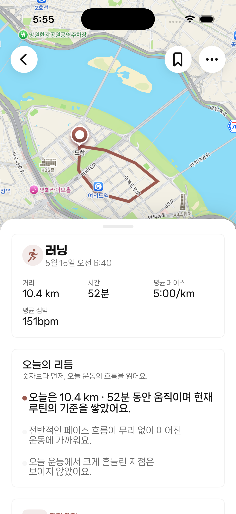
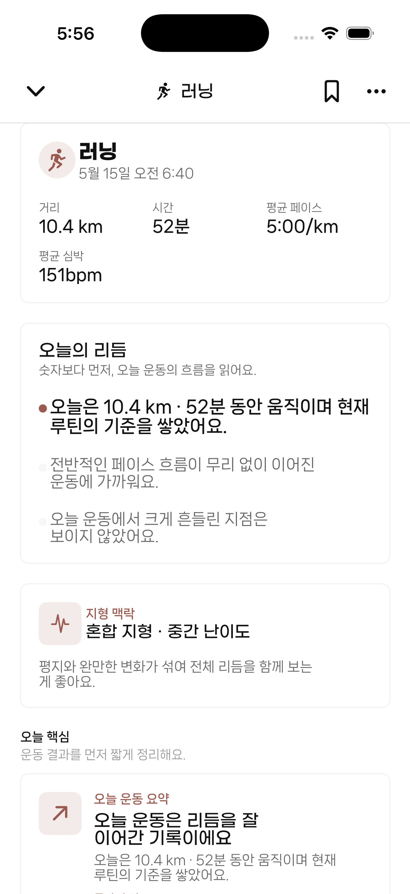
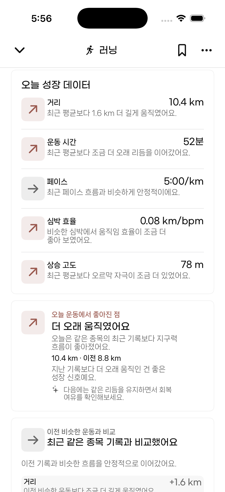
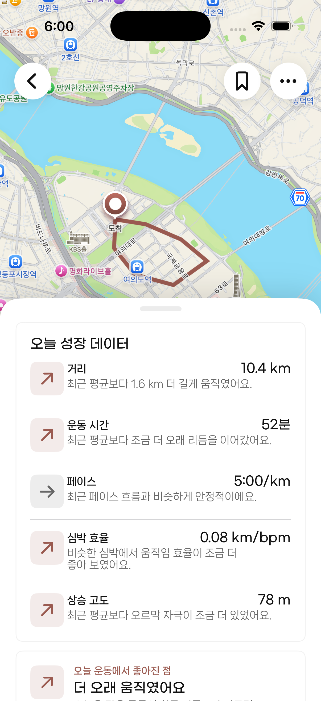

# SOOM 0009 Verification

Date: 2026-06-23

Task: `tasks/soom/0009-record-detail-content-lock.md`

Build verified:

```sh
xcodebuild -project SOOM.xcodeproj -scheme SOOM -destination 'platform=iOS Simulator,name=iPhone 17 Pro' build
```

Result: `BUILD SUCCEEDED`

Simulator:

- Device: iPhone 17 Pro
- Runtime: iOS 26.5
- Bundle: `app.soom.prototype`
- Route-backed detail entry: first visible feed running card, `비 오는 아침 러닝`

## Screenshots

### 1. Preview State



Findings:

- Route-backed `WorkoutDetailView` enters `WorkoutMapSheetScaffold`.
- Map renders behind the bottom sheet.
- Sheet opens in the production preview/standard state, not minimized.
- Route rendering remains visible and readable.

### 2. Expanded State



Findings:

- Upward drag from the preview handle expands the sheet.
- Expanded state covers the map with a white detail surface.
- Expanded header remains visible with the chevron, sport title, bookmark, and more actions.

### 3. Expanded After Scroll



Findings:

- Internal content scrolls while the sheet remains expanded.
- The map does not reappear during expanded scrolling.
- Scroll interaction does not collapse the sheet through overscroll.

### 4. Collapsed Back To Preview



Findings:

- Tapping the visible expanded header chevron collapses the sheet back to preview.
- Collapse returns to the map-backed preview state, not a minimized state.
- The expanded scroll position is preserved when collapsed, which is acceptable for this behavior pass but may need a product decision later.

## Interaction Fix

Changed `WorkoutMapSheetScaffold` only:

- Centralized expanded collapse into `collapseToPreview()`.
- Added a transparent leading hit target over the expanded header chevron area.
- Added a downward-drag gesture to the same chevron/handle target.
- Kept expanded scroll content from owning collapse.
- Kept snap behavior limited to preview/standard and expanded.

## Remaining Gaps Vs Frame Lock Spec

- Preview sheet top still does not exactly match `screenHeight * 0.64`.
- Production scaffold still uses height-based bottom-sheet metrics instead of absolute top-offset anchors.
- `WorkoutSheetPosition.minimized` still exists globally, though this scaffold does not snap to it.
- Fixed top nav still uses the existing sheet header structure, not the exact prototype hierarchy.
- Content padding and preview content pruning still differ from the Strava Frame Lock spec.
- Map camera still changes with sheet position.

## Recommendation

PASS

Reason:

- Preview, expanded, expanded-after-scroll, and collapsed-back-to-preview states were all captured successfully.
- No minimized production state was observed.
- Expanded scrolling no longer causes overscroll collapse.
- Header-owned collapse now works through the visible chevron area.
